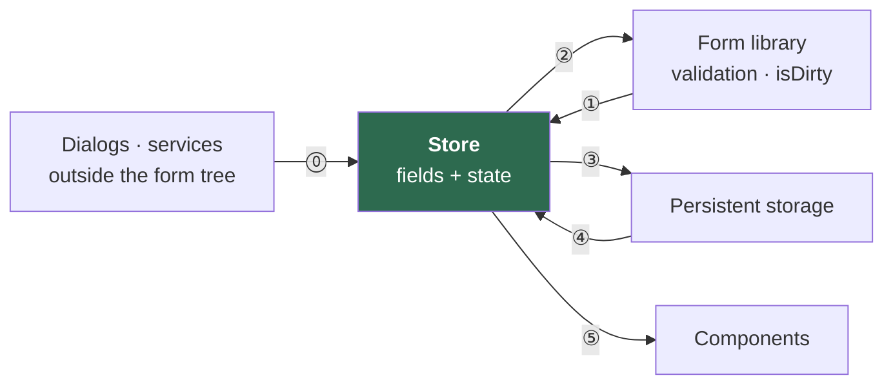
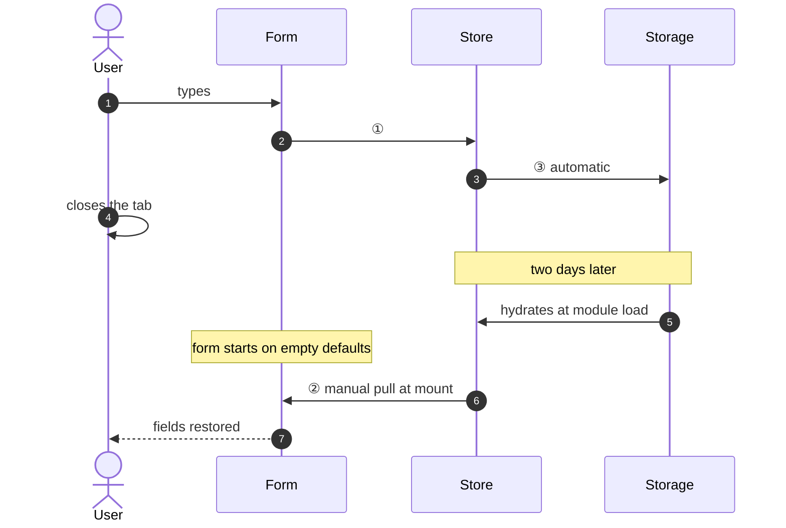
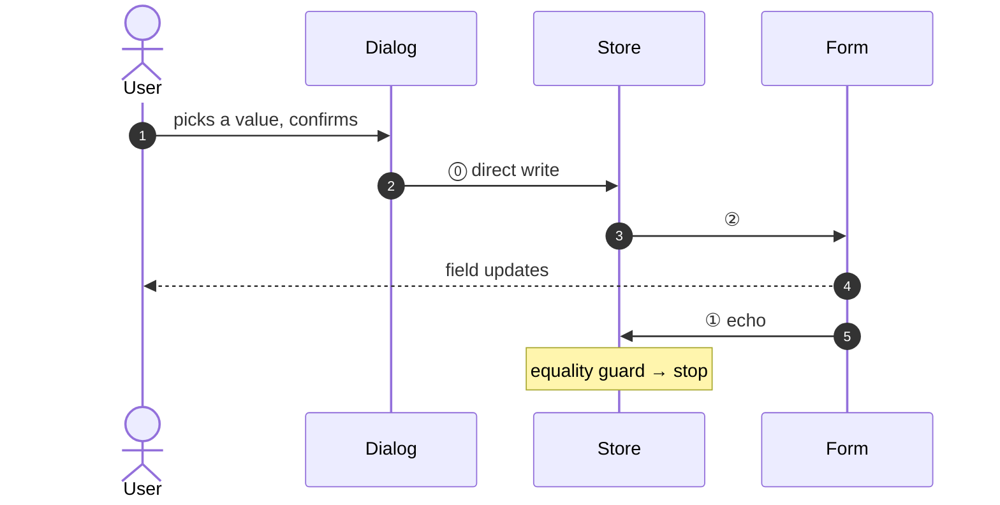
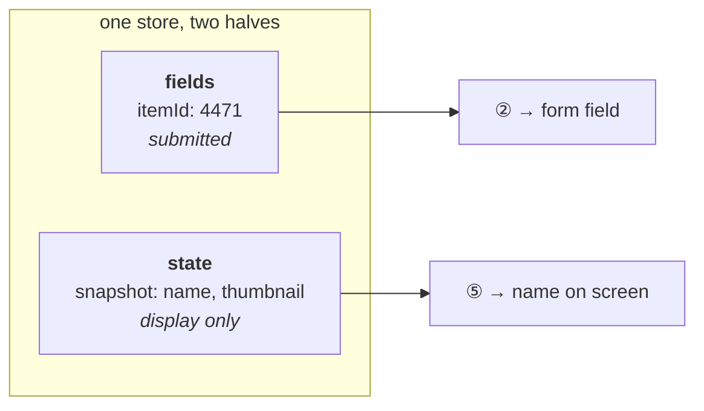
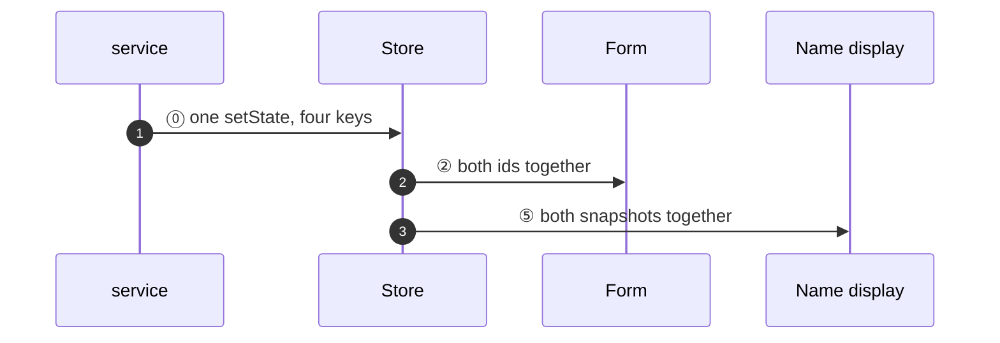
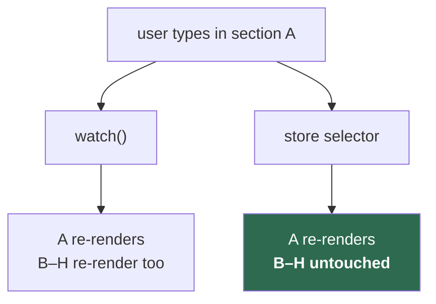
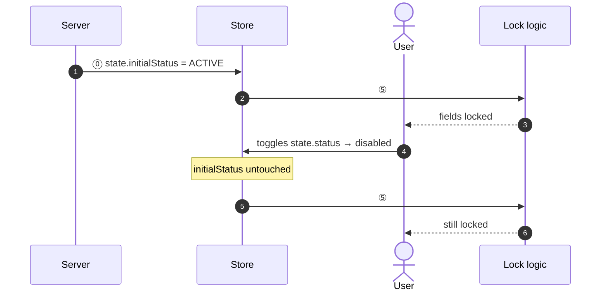
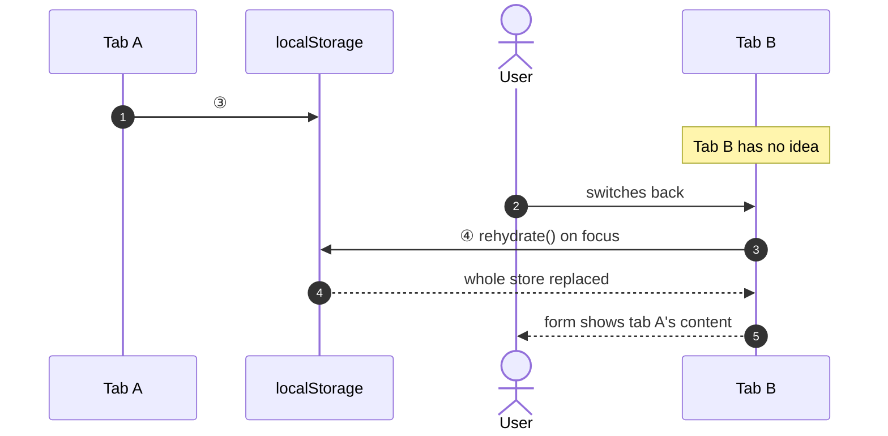
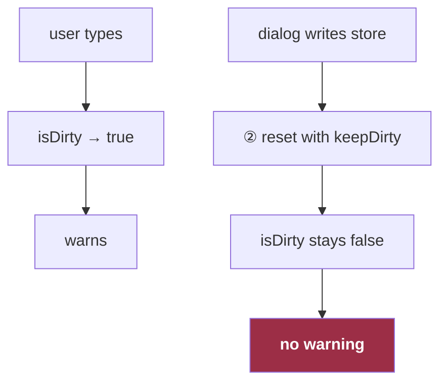

# Eight Questions About Form State

Eight requirements from an admin console of twenty long forms. One statement and one diagram each.

Where all eight land:



⓪ direct write · ① values change · ② `reset(fields)` · ③ automatic persist · ④ `rehydrate()` on focus · ⑤ selector subscription

---

## How does a user get their half-finished form back two days later?

Every keystroke writes to the store, and the persistence middleware writes after every store mutation. Two days later the store hydrates **before React renders** — so the form has to pull from it once at mount, because change-only subscriptions will never fire for a value that was already there.



> Delete that one-line pull and the form shows empty defaults over a perfectly good draft. It looks redundant in review.

---

## How does a dialog at the app root write into a field it can't reach?

It doesn't reach the field. It writes the store, and the store→form edge delivers it.



---

## How do you display the name of an item that no longer exists?

Store the shape the user selected, at selection time, next to the fields. It is not a form field — it is never submitted — so the store keeps a second half for exactly this.



> The option list is fetched fresh. A delisted item is gone from it, and the draft would render a bare id.

---

## When a parent changes, how do four dependent values change without a visible intermediate state?

One `setState` writes all four in the same tick — two ids in `fields`, two snapshots in `state`.

```ts
store.setState(prev => ({
  ...prev,
  fields: { ...prev.fields, parentId: next.id, childId: null },
  state:  { ...prev.state, parentSnapshot: next, childSnapshot: null },
}))
```



> Four separate writes are four separate renders — the old child's name beside the new parent's id.

---

## How does one section of an eight-section form re-render without the other seven?

Read through a store selector, not the form library's `watch()`.



> `watch()` re-renders the whole subscribed subtree on any field change. A selector fires only for its own value.

---

## How do you lock fields on the server's original answer after the user has already toggled it?

Keep the server's answer in the `state` half, where the user's toggle cannot reach it.

```ts
useFormStoreSelector(s => s.state.initialStatus === STATUS.ACTIVE)
```



---

## How does a second tab learn that the first tab edited the same record?

It doesn't, until it regains focus and reads storage on purpose. Persistence middleware hydrates once at creation and ignores the browser's `storage` event.



> If the key is one constant and the route is `/record/:id/edit`, this is how one record's content lands in another record's form.

---

## Why doesn't the unsaved-changes warning fire when a dialog changed the value?

Because edge ② uses `reset(fields, { keepDirty: true })` as a transport, and `keepDirty` preserves an existing `true` — it never turns `false` into `true`.



> Compensated with a second signal: `isDirty || hasDraft`. In edit mode `hasDraft` is true from page load, so it over-warns. That was accepted as the safer failure.

---

## What the eight answers add up to

| Question | ⓪ | ① | ② | ③ | ④ | ⑤ |
|---|---|---|---|---|---|---|
| 1 · Draft after two days | | ● | ● | ● | | |
| 2 · Dialog writes a field | ● | ● | ● | | | |
| 3 · Name of a deleted item | ● | | ● | | | ● |
| 4 · Four values, one tick | ● | | ● | | | ● |
| 5 · One section re-renders | | ● | | | | ● |
| 6 · Lock on the original answer | ● | | | | | ● |
| 7 · Two tabs | | | ● | ● | ● | |
| 8 · Warning misses an edit | ● | ● | ● | | | |

**Only questions 1 and 7 need persistence.** The other six are answered by two parties.

**Edge ⑤ answers four of them — more than persistence does.** The store's job is less "mirror the form" than "hold what the form has no room for": snapshots that outlive their option list, the server's original answer, per-value subscriptions.

---

## The four edges one hook owns

⓪ is whatever calls `setState`, and ⑤ is ordinary selector subscription — neither needs synchronizing. The other four are a single hook, and in code they carry names:



```mermaid
flowchart TB
    F["<b>React Hook Form</b><br/>user input · validation · isDirty"]
    S["<b>zustand store</b><br/><i>source of truth</i>"]
    P["<b>localStorage</b>"]

    F -- "syncFormToStore" --> S
    S -- "syncStoreToForm" --> F
    S -- "persist middleware" --> P
    P -- "rehydrate&#40;&#41;" --> S

    style S fill:#2d6a4f,color:#fff
```

Both vertical pairs are asymmetric in the same way: the downward edge is automatic, the upward edge has to be asked for. `syncFormToStore` fires on every keystroke; `syncStoreToForm` needs an explicit pull at mount. The middleware persists on every write; `rehydrate()` happens only when someone calls it.

---

## Nine difficulties

The diagram is four arrows. Implementing those four arrows is not four lines, because each one has a way of going wrong that produces no error.

| # | Difficulty | What it looks like when it bites |
|---|---|---|
| 1 | Two owners of one value | Infinite loop: form writes store, store writes form, repeat |
| 2 | `subscribe` is change-only | Empty form over a valid draft — the value was already correct, so no change ever fires |
| 3 | `reset` is being used as transport | Unsaved-changes warning silently disarmed on every store push |
| 4 | Storage never announces itself | Second tab stale forever; no `storage` event is observed |
| 5 | Remote data arrives more than once | Focus revalidation replaces the store and destroys in-flight edits |
| 6 | Programmatic writes look like user writes | A brand-new create page stamps a draft the user never typed |
| 7 | One key, many records | Record #1's content appears in record #2's form, across tabs |
| 8 | The store is a module singleton | Two mounted forms fight over `reset`; stale `isDirty` leaks across routes |
| 9 | Reference equality is not value equality | Object fields with identical content trigger spurious resets |

None of these throw. Every one of them ships.

---

## The tool

A single hook closes 1, 2, 3, 4, 8 and 9, and offers an opt-in flag for 7 — hold that one lightly; the last section is about how that flag went. What follows is a reference implementation: the same structure and guards, types generalized.

**Two layers.** The factory runs once per store at module load; the hook it returns runs per mount.

```ts
export const createFormStoreSync = <TDto extends FormDto>(
  store: PersistedStore<TDto>,
) => {
  // Read at factory time, not at cleanup time. Reading it later risks
  // seeing a noop another consumer swapped in, stranding the store.  [8]
  const originalStorage = store.persist.getOptions().storage
  let mountCount = 0

  // Dev-only. The NODE_ENV comparison is a build-time constant, so the
  // whole branch — effect, counter, message — leaves the prod bundle.  [8]
  const useAssertSingleConsumer =
    process.env.NODE_ENV === 'production'
      ? () => {}
      : () => {
          useEffect(() => {
            mountCount += 1
            if (mountCount > 1) {
              console.error(
                'Two mounted consumers will fight over form.reset and corrupt each other. '
                + 'Mount this once per store, or share the form through context.',
              )
            }
            return () => { mountCount -= 1 }
          }, [])
        }

  return function useFormStoreSync(
    form: FormApi<TDto['fields']>,
    { skipPersist = false } = {},
  ) {
    useAssertSingleConsumer()

    // Suppress persistence without touching the runtime sync. Swaps the
    // middleware's storage for a noop; edges 1 and 2 keep working.  [7]
    useEffect(() => {
      if (!skipPersist) return
      store.persist.setOptions({ storage: noopStorage })
      return () => { store.persist.setOptions({ storage: originalStorage }) }
    }, [skipPersist])

    // The only path by which storage pushes upstream. Middleware hydrates
    // once at creation and ignores the cross-document storage event.  [4]
    useEffect(() => {
      if (skipPersist) return
      const pull = async () => {
        await store.persist.rehydrate()
        // keepErrors as well: the user is returning to this tab and may
        // have validation messages on screen worth preserving.  [3]
        form.reset(store.getState().fields, { keepDirty: true, keepErrors: true })
      }
      const onVisible = () => {
        if (document.visibilityState === 'visible') pull()
      }
      window.addEventListener('focus', pull)
      document.addEventListener('visibilitychange', onVisible)
      return () => {
        window.removeEventListener('focus', pull)
        document.removeEventListener('visibilitychange', onVisible)
      }
    }, [form, skipPersist])

    // Edge 1. The guard reads the store fresh rather than closing over
    // it, so it can never compare against a stale snapshot.  [1] [9]
    useEffect(() => {
      return form.subscribe({ values: true }, (values) => {
        if (deepEqual(values, store.getState().fields)) return
        store.setState(prev => ({ ...prev, fields: values }))
      })
    }, [form])

    // Edge 2, and the symmetric guard.
    useEffect(() => {
      const push = (fields: TDto['fields']) => {
        if (deepEqual(form.getValues(), fields)) return
        // reset as transport, not as reset: keepDirty or the unsaved
        // warning is cleared on every store push.  [3]
        form.reset(fields, { keepDirty: true })
      }
      // subscribe is change-only, and the store was already correct
      // before React rendered — so pull once, by hand.  [2]
      push(store.getState().fields)
      return store.subscribe(state => push(state.fields))
    }, [form])
  }
}
```

Both guards compare **values, not provenance**. Neither side remembers whose write it was; each simply refuses to act when there is nothing to do, which ends the cycle after one bounce in either direction.

Difficulties 5 and 6 are not here. 5 needs a one-shot ref in the initializer; 6 needs a flag around programmatic resets, and ideally a branded reset type so that passing a raw one is a compile error.

---

## What it cost

Difficulty 7, in the field. Twenty forms used this hook. Twelve persisted to `sessionStorage`, which is per-tab, so the difficulty cannot reach them. The other eight shared one `localStorage` key behind `/record/:id/edit`, and each had to pass the opt-in flag.

**Five of the eight passed it. Three did not** — same route shape, same key, same factory. It compiled, because the option is optional. It passed review, because a missing argument is invisible. It worked in every single-tab test, because the bug needs two tabs on two records.

> A correctness property that depends on every call site opting in will be violated in proportion to the number of call sites.

Make the suppression structural — decided by the factory, not the page — and the flag, its ordering contract, and all three bugs stop existing at once.
