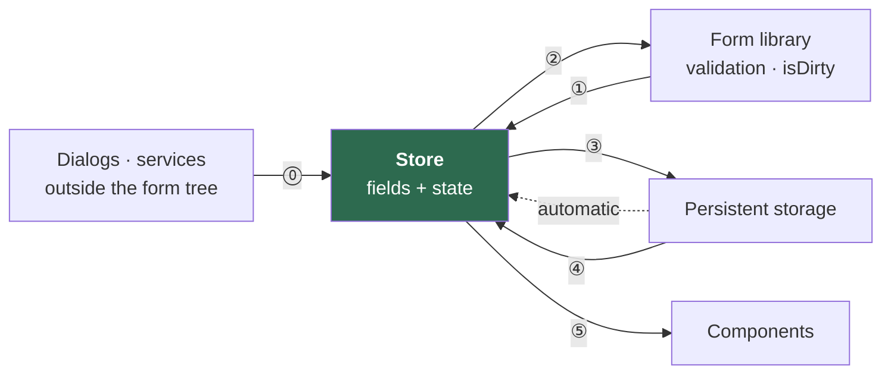
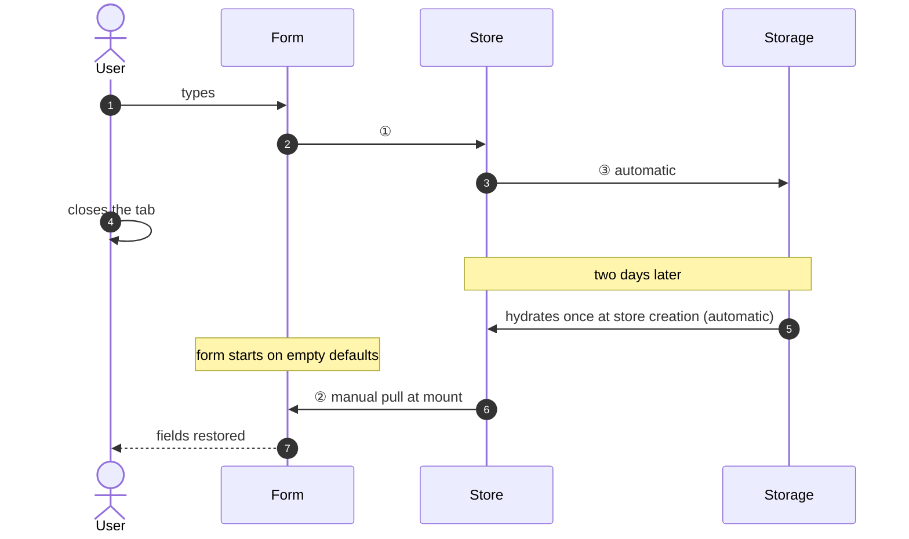
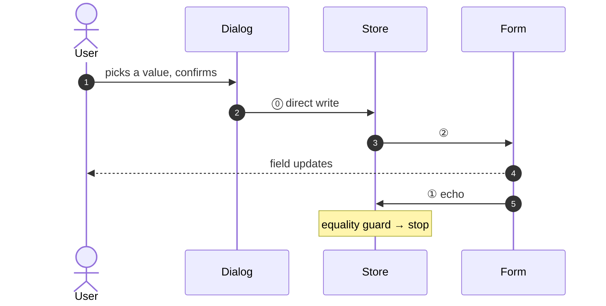
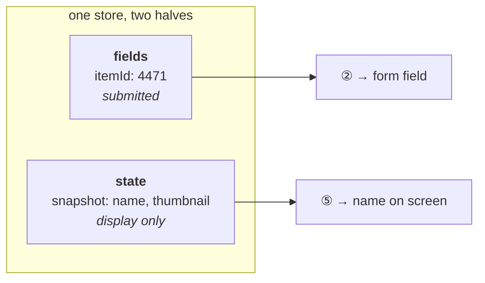
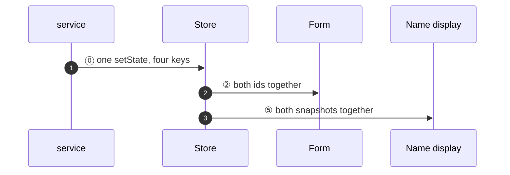
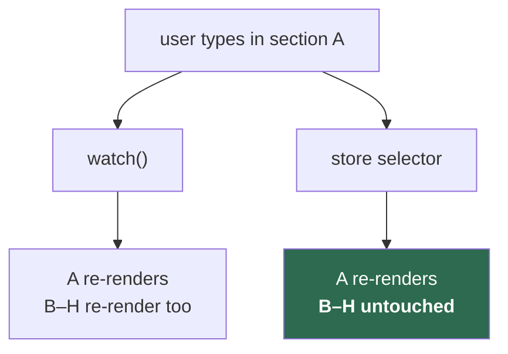
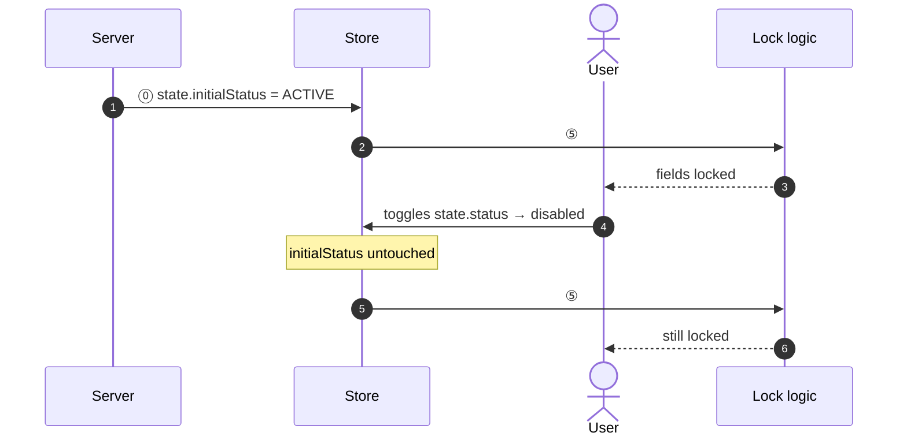
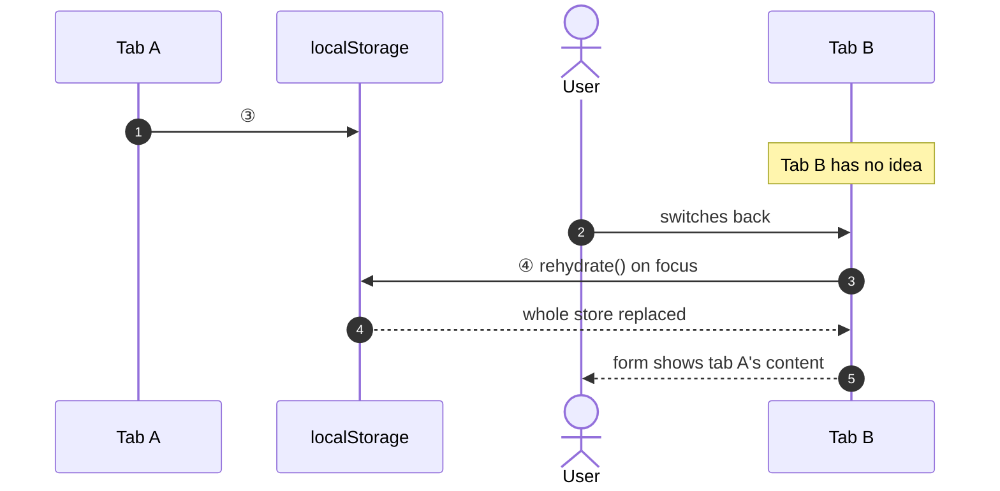
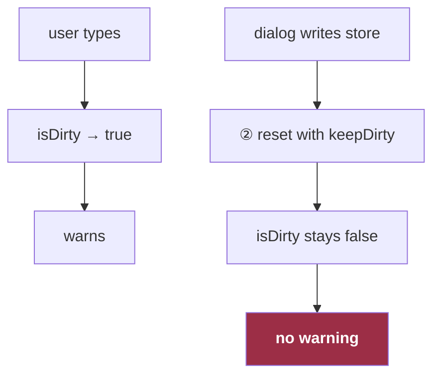

# Eight Questions About Form State

Eight requirements from an admin console of twenty long forms, and the three parties they end up needing — form library, store, persistent storage. One statement and one diagram each.

Where all eight land:



⓪ direct write · ① values change · ② `reset(fields)` · ③ automatic persist · ④ `rehydrate()` on focus · ⑤ selector subscription. The dotted arrow is the middleware hydrating once at store creation — automatic, and never again.

---

## How does a user get their half-finished form back two days later?

Every keystroke writes to the store, and the persistence middleware writes after every store mutation. Two days later the store hydrates **before React renders** — so the form has to pull from it once at mount, because change-only subscriptions will never fire for a value that was already there.



> Delete that one-line pull and the form shows empty defaults over a perfectly good draft. It looks redundant in review.

---

## How does a dialog at the app root write into a field it can't reach?

It doesn't reach the field. It writes the store, and the store→form edge delivers it.



---

## How do you display the name of an item that no longer exists?

Store the shape the user selected, at selection time, next to the fields. It is not a form field — it is never submitted — so the store keeps a second half for exactly this.



> The option list is fetched fresh. A delisted item is gone from it, and the draft would render a bare id.

---

## When a parent changes, how do four dependent values change without a visible intermediate state?

One `setState` writes all four in the same tick — two ids in `fields`, two snapshots in `state`.

```ts
// next: the newly selected parent
store.setState(prev => ({
  ...prev,
  fields: { ...prev.fields, parentId: next.id, childId: null },
  state:  { ...prev.state, parentSnapshot: next, childSnapshot: null },
}))
```



> Four separate writes are four separate renders — the old child's name beside the new parent's id.

---

## How does one section of an eight-section form re-render without the other seven?

Read through a store selector, not the form library's `watch()`.



> `watch()` re-renders the whole subscribed subtree on any field change. A selector fires only for its own value.

---

## How do you lock fields on the server's original answer after the user has already toggled it?

Keep the server's answer in the `state` half, where the user's toggle cannot reach it: `status` moves with the toggle, `initialStatus` never does.

```ts
useFormStoreSelector(s => s.state.initialStatus === STATUS.ACTIVE)
```



---

## How does a second tab learn that the first tab edited the same record?

It doesn't, until it regains focus and reads storage on purpose. Persistence middleware hydrates once at creation and ignores the browser's `storage` event.



> If the key is one constant and the route is `/record/:id/edit`, this is how one record's content lands in another record's form.

---

## Why doesn't the unsaved-changes warning fire when a dialog changed the value?

Because edge ② uses `reset(fields, { keepDirty: true })` as a transport, and `keepDirty` preserves an existing `true` — it never turns `false` into `true`.



> Compensated with a second signal: `isDirty || hasDraft`. In edit mode `hasDraft` is true from page load, so it over-warns. That was accepted as the safer failure.

---

## What the eight answers add up to

| Question | ⓪ | ① | ② | ③ | ④ | ⑤ |
|---|---|---|---|---|---|---|
| 1 · Draft after two days | | ● | ● | ● | | |
| 2 · Dialog writes a field | ● | ● | ● | | | |
| 3 · Name of a deleted item | ● | | ● | | | ● |
| 4 · Four values, one tick | ● | | ● | | | ● |
| 5 · One section re-renders | | ● | | | | ● |
| 6 · Lock on the original answer | ● | | | | | ● |
| 7 · Two tabs | | | ● | ● | ● | |
| 8 · Warning misses an edit | ● | ● | ● | | | |

**Only questions 1 and 7 need persistence.** The other six are answered by two parties.

**Edge ⑤ answers four of them — more than persistence does.** The store's job is less "mirror the form" than "hold what the form has no room for": snapshots that outlive their option list, the server's original answer, per-value subscriptions.

---

## The four edges one hook owns

⓪ is whatever calls `setState`, and ⑤ is ordinary selector subscription — neither needs synchronizing. Of the other four, ③ is middleware configuration; the hook only switches it on and off. The remaining three are the hook, and in code they carry names:

```mermaid
flowchart TB
    F["<b>React Hook Form</b><br/>user input · validation · isDirty"]
    S["<b>zustand store</b><br/><i>source of truth</i>"]
    P["<b>localStorage</b>"]

    F -- "syncFormToStore" --> S
    S -- "syncStoreToForm" --> F
    S -- "persist middleware" --> P
    P -- "rehydrate&#40;&#41;" --> S

    style S fill:#2d6a4f,color:#fff
```



Both vertical pairs are asymmetric in the same way: the downward edge is automatic, the upward edge has to be asked for. `syncFormToStore` fires on every keystroke; `syncStoreToForm` needs an explicit pull at mount. The middleware persists on every write; `rehydrate()` happens only when someone calls it.

---

## Nine difficulties

The diagram is four arrows. Implementing those four arrows is not four lines, because each one has a way of going wrong that produces no error.

| # | Difficulty | What it looks like when it bites |
|---|---|---|
| 1 | Two owners of one value | Infinite loop: form writes store, store writes form, repeat |
| 2 | `subscribe` is change-only | Empty form over a valid draft — the value was already correct, so no change ever fires |
| 3 | `reset` is being used as transport | Unsaved-changes warning silently disarmed on every store push |
| 4 | Storage never announces itself | Second tab stale forever; the browser fires `storage`, the middleware never listens |
| 5 | Remote data arrives more than once | Focus revalidation replaces the store and destroys in-flight edits |
| 6 | Programmatic writes look like user writes | A brand-new create page stamps a draft the user never typed |
| 7 | One key, many records | Record #1's content appears in record #2's form, across tabs |
| 8 | The store is a module singleton | Two mounted forms fight over `reset`; stale `isDirty` leaks across routes |
| 9 | Reference equality is not value equality | Object fields with identical content trigger spurious resets |

None of these throw. Every one of them ships.

---

## The tool

A single hook closes difficulties 1, 2, 3, 4 and 9, turns 8 into a dev-time error, and offers an opt-in flag for 7 — hold that one lightly; the last section is about how that flag went. Below is the hook with types simplified. The production version, including the initializer that handles 5 and 6, is [`reference/create-form-store-helper.ts`](reference/create-form-store-helper.ts).

### The shape

Two layers: the factory runs once per store at module load; the hook it returns runs per mount. The hook *is* the diagram — four effects, one per arrow, named after their edges. The rest of this section is the body of each one, declared inside the hook so it closes over `form`, `store` and `skipPersist`.

```ts
export const createFormStoreSync = (store: PersistedStore) => {
  const originalStorage = store.persist.getOptions().storage   // read once, here — see ③
  let mountCount = 0                                            // see difficulty 8

  return function useFormStoreSync(form: FormApi, { skipPersist = false } = {}) {
    useEffect(syncFormToStore,  [form])               // ① F → S
    useEffect(syncStoreToForm,  [form])               // ② S → F
    useEffect(togglePersist,    [skipPersist])        // ③ S → P   on/off only; the middleware writes
    useEffect(rehydrateOnFocus, [form, skipPersist])  // ④ P → S
  }
}
```

### What the code assumes

```ts
type FormDto = { fields: object; state: object }      // the two halves from question 3

type FormApi = {                                      // the three React Hook Form methods used
  getValues(): FormDto['fields']
  reset(values: FormDto['fields'], options?: { keepDirty?: boolean; keepErrors?: boolean }): void
  subscribe(options: { formState: { values: true }; callback: (state: { values: FormDto['fields'] }) => void }): () => void
}

type PersistedStore = StoreApi<FormDto> & {           // zustand's StoreApi + what the persist middleware adds
  persist: {
    rehydrate(): Promise<void>
    getOptions(): { storage: Storage }
    setOptions(options: { storage: Storage }): void
  }
}

declare const deepEqual: (a: unknown, b: unknown) => boolean   // structural — difficulty 9 is about `===`
const noopStorage = { getItem: () => null, setItem: () => {}, removeItem: () => {} }
```

### ① `syncFormToStore` — every keystroke, one direction

```ts
function syncFormToStore() {
  return form.subscribe({
    formState: { values: true },
    callback: ({ values }) => {
      // Difficulty 1 (two owners) + 9 (reference equality): compare by value against the
      // *live* store, not a closed-over snapshot, and refuse to write when nothing changed.
      if (deepEqual(values, store.getState().fields)) return
      store.setState(prev => ({ ...prev, fields: values }))
    },
  })
}
```

### ② `syncStoreToForm` — the mirror image, plus one pull by hand

```ts
function syncStoreToForm() {
  const push = (fields: FormDto['fields']) => {
    if (deepEqual(form.getValues(), fields)) return    // the other half of the loop guard
    // Difficulty 3: reset is transport here, not reset. Without keepDirty every
    // store push clears isDirty and disarms the unsaved-changes warning.
    form.reset(fields, { keepDirty: true })
  }
  // Difficulty 2: subscribe is change-only, and the draft was already in the store
  // before React rendered — no change will ever fire for it. Pull once, by hand.
  push(store.getState().fields)
  return store.subscribe(state => push(state.fields))
}
```

The two guards are symmetric and compare **values, not provenance**. Neither side remembers whose write it was; each refuses to act when there is nothing to do, which ends the cycle after one bounce in either direction.

### ③ `togglePersist` — the opt-in flag for difficulty 7

```ts
function togglePersist() {
  if (!skipPersist) return
  store.persist.setOptions({ storage: noopStorage })   // ① and ② keep running; nothing reaches storage
  return () => store.persist.setOptions({ storage: originalStorage })
}
```

`originalStorage` is captured at factory time, not read back at cleanup. Read at cleanup, it could be the noop another consumer swapped in, and the store would be stranded on noop storage — another consequence of difficulty 8.

The flag also carries an ordering contract: this hook must be called before the initializer in the same component, or the initializer's `setState(serverData)` runs while real storage is still attached and writes the record through.

### ④ `rehydrateOnFocus` — the only upstream path from storage

```ts
function rehydrateOnFocus() {
  if (skipPersist) return
  const pull = async () => {
    // Difficulty 4: the middleware hydrates once at creation and never listens to the
    // cross-document `storage` event. Reading storage again is a deliberate act.
    await store.persist.rehydrate()
    form.reset(store.getState().fields, { keepDirty: true, keepErrors: true })
  }
  const onVisible = () => { if (document.visibilityState === 'visible') pull() }
  window.addEventListener('focus', pull)
  document.addEventListener('visibilitychange', onVisible)
  return () => {
    window.removeEventListener('focus', pull)
    document.removeEventListener('visibilitychange', onVisible)
  }
}
```

The `reset` after `rehydrate()` is mostly a second pass: `rehydrate()` fires the store subscription from ② synchronously, so ②'s `reset` has already run — without `keepErrors`. Move `keepErrors` into ②'s `push` and this line can go.

### Difficulty 8 — a dev-time guard, not a fix

The store is a module singleton, so two mounted consumers would both call `form.reset` on it. The hook can't prevent that; it can make it loud — a fifth effect, dev builds only:

```ts
function assertSingleConsumer() {
  mountCount += 1
  if (mountCount > 1) {
    console.error('Two mounted consumers will fight over form.reset and corrupt each other. '
      + 'Mount this once per store, or share the form through context.')
  }
  return () => { mountCount -= 1 }
}
```

The production version selects this or a no-op by `NODE_ENV` at module load; the comparison is a build-time constant, so the whole thing leaves the prod bundle.

### Difficulties 5 and 6 — the initializer's, not the sync's

- **5 · Remote data arrives more than once.** The init hook applies the first non-`undefined` server DTO and then ignores every later reference — a `useRef` flag. Without it, SWR's `revalidateOnFocus` returns a fresh object, `setState(dto, true)` replaces the whole store, and in-flight edits are gone.
- **6 · Programmatic writes look like user writes.** "Has a draft" means the store differs from its defaults, and ① cannot tell a keystroke from a direct `form.reset(data)` — both change the values, both pass the guard, both write the store. So programmatic writes go store-first: ② delivers them, ① sees equal values and stays silent, and a branded reset type makes the raw one a compile error. The create page adds one check on mount — is what persisted a leftover from an edit session? — and discards it if so.

---

## What it cost

Difficulty 7, in the field. Twenty forms used this hook. Twelve persisted to `sessionStorage`, which is per-tab, so the difficulty cannot reach them. The other eight shared one `localStorage` key behind `/record/:id/edit`, and each had to pass the opt-in flag.

**Five of the eight passed it. Three did not** — same route shape, same key, same factory. It compiled, because the option is optional. It passed review, because a missing argument is invisible. It worked in every single-tab test, because the init hook overwrites the store with the server's record on every edit-page mount — the bug needs two tabs on two records, and the second tab regaining focus.

The flag also has a price nobody wrote down: a form that passes it has no draft. Question 1 is answered for twelve forms and forfeited for eight.

> A correctness property that depends on every call site opting in will be violated in proportion to the number of call sites.

Make the suppression structural — decided by the factory, not the page — and the flag, its ordering contract, and all three bugs stop existing at once.
