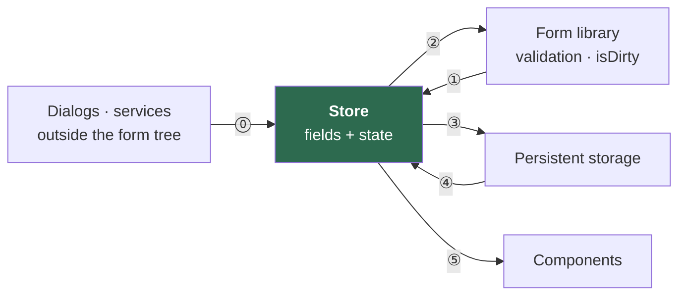
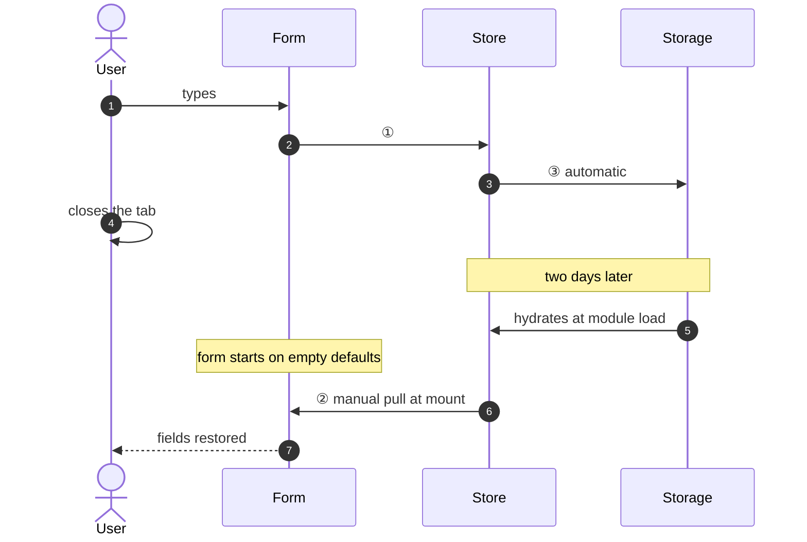
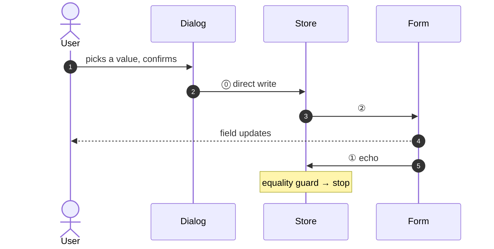
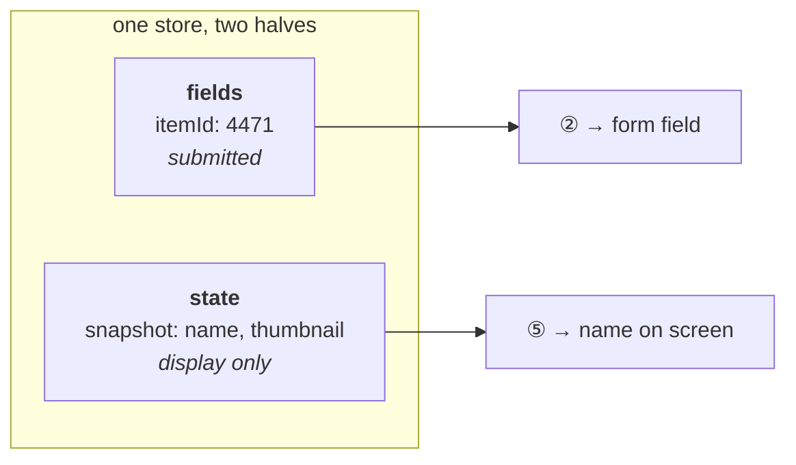
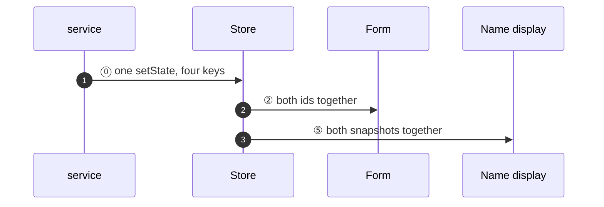
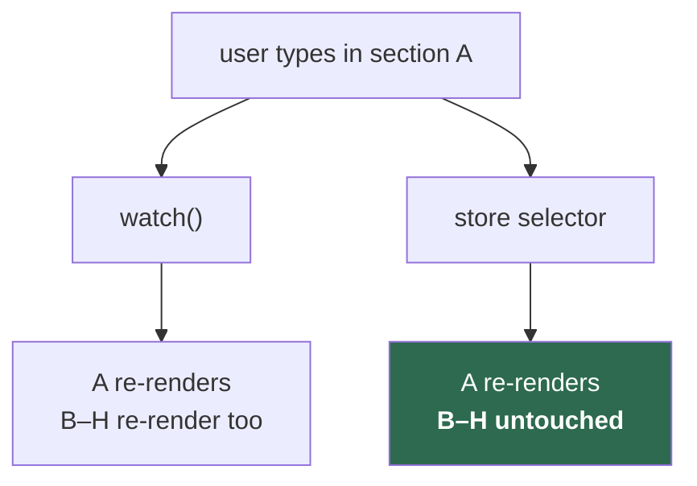
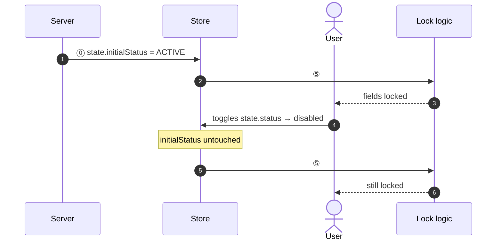
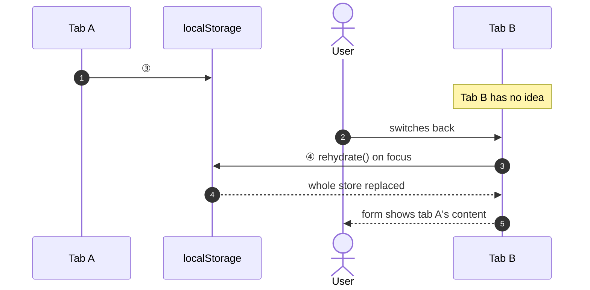
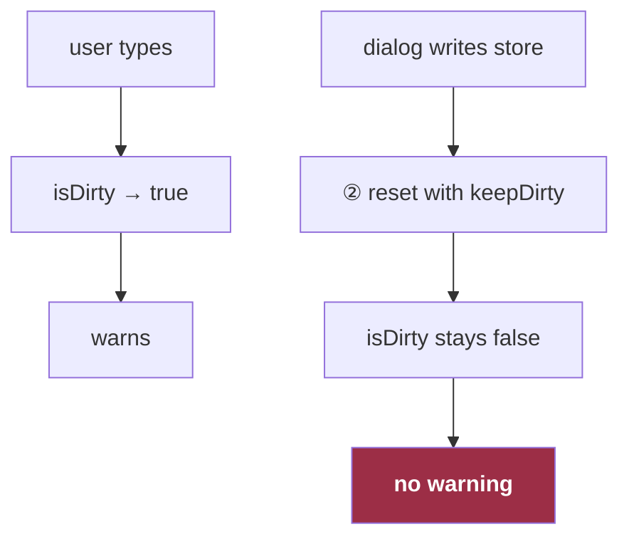

# Eight Questions About Form State

Each question is something a product actually asked for. Each answer is one statement and one diagram.

The architecture all eight land on:



⓪ direct write · ① values change · ② `reset(fields)` · ③ automatic persist · ④ `rehydrate()` on focus · ⑤ selector subscription

---

## How does a user get their half-finished form back two days later?

Every keystroke writes to the store, and the persistence middleware writes after every store mutation. Two days later the store hydrates **before React renders** — so the form has to pull from it once at mount, because change-only subscriptions will never fire for a value that was already there.



> Delete that one-line pull and the form shows empty defaults over a perfectly good draft. It looks redundant in review.

---

## How does a dialog at the app root write into a field it can't reach?

It doesn't reach the field. It writes the store, and the store→form edge delivers it.



---

## How do you display the name of an item that no longer exists?

Store the shape the user selected, at selection time, next to the fields. It is not a form field — it is never submitted — so the store keeps a second half for exactly this.



> The option list is fetched fresh. A delisted item is gone from it, and the draft would render a bare id.

---

## When a parent changes, how do four dependent values change without a visible intermediate state?

One `setState` writes all four in the same tick — two ids in `fields`, two snapshots in `state`.

```ts
store.setState(prev => ({
  ...prev,
  fields: { ...prev.fields, parentId: next.id, childId: null },
  state:  { ...prev.state, parentSnapshot: next, childSnapshot: null },
}))
```



> Four separate writes are four separate renders — the old child's name beside the new parent's id.

---

## How does one section of an eight-section form re-render without the other seven?

Read through a store selector, not the form library's `watch()`.



> `watch()` re-renders the whole subscribed subtree on any field change. A selector fires only for its own value.

---

## How do you lock fields on the server's original answer after the user has already toggled it?

Keep the server's answer in the `state` half, where the user's toggle cannot reach it.

```ts
useFormStoreSelector(s => s.state.initialStatus === STATUS.ACTIVE)
```



---

## How does a second tab learn that the first tab edited the same record?

It doesn't, until it regains focus and reads storage on purpose. Persistence middleware hydrates once at creation and ignores the browser's `storage` event.



> If the key is one constant and the route is `/record/:id/edit`, this is how one record's content lands in another record's form.

---

## Why doesn't the unsaved-changes warning fire when a dialog changed the value?

Because edge ② uses `reset(fields, { keepDirty: true })` as a transport, and `keepDirty` preserves an existing `true` — it never turns `false` into `true`.



> Compensated with a second signal: `isDirty || hasDraft`. In edit mode `hasDraft` is true from page load, so it over-warns. That was accepted as the safer failure.

---

## What the eight answers add up to

| Question | ⓪ | ① | ② | ③ | ④ | ⑤ |
|---|---|---|---|---|---|---|
| 1 · Draft after two days | | ● | ● | ● | | |
| 2 · Dialog writes a field | ● | ● | ● | | | |
| 3 · Name of a deleted item | ● | | ● | | | ● |
| 4 · Four values, one tick | ● | | ● | | | ● |
| 5 · One section re-renders | | ● | | | | ● |
| 6 · Lock on the original answer | ● | | | | | ● |
| 7 · Two tabs | | | ● | ● | ● | |
| 8 · Warning misses an edit | ● | ● | ● | | | |

**Only questions 1 and 7 need persistence.** The other six are answered by two parties.

**Edge ⑤ answers four of them — more than persistence does.** The store's job is less "mirror the form" than "hold what the form has no room for": snapshots that outlive their option list, the server's original answer, per-value subscriptions.

---

## The mechanism

Edges ① and ② are opposite subscriptions, each opening with the same guard:

```ts
// ① form → store
form.subscribe({ values: true }, values => {
  if (deepEqual(values, store.getState().fields)) return
  store.setState(prev => ({ ...prev, fields: values }))
})

// ② store → form
store.subscribe(state => {
  if (deepEqual(form.getValues(), state.fields)) return
  form.reset(state.fields, { keepDirty: true })
})
```

Value equality, not provenance. Neither side remembers whose write it was; each refuses to act when there is nothing to do. The cycle terminates after one bounce in both directions.

③ is free. ④ is the focus listener. ⑤ needs no synchronization at all, which is why it answers the most questions.

---

## What it cost

Twenty forms used this. Eight persisted to `localStorage` behind `/record/:id/edit` with one shared key, and needed an opt-in flag to suppress persistence in edit mode.

**Five of the eight passed it. Three did not** — same route shape, same key, same factory. It compiled, because the option is optional. It passed review, because a missing argument is invisible. It worked in every single-tab test, because the bug needs two tabs on two records.

> A correctness property that depends on every call site opting in will be violated in proportion to the number of call sites.

Make the suppression structural — decided by the factory, not the page — and the flag, its ordering contract, and all three bugs stop existing at once.
