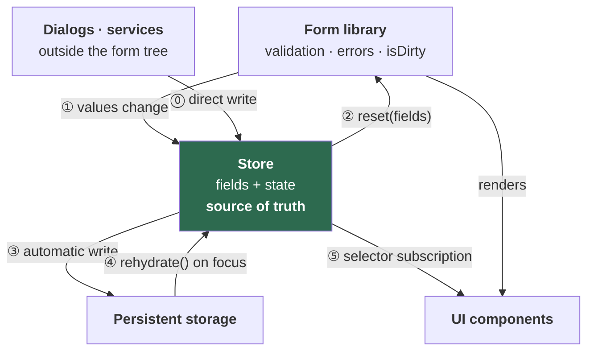
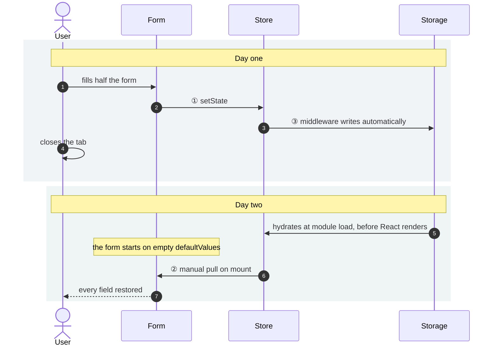
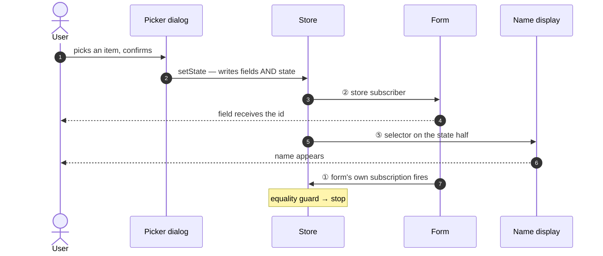
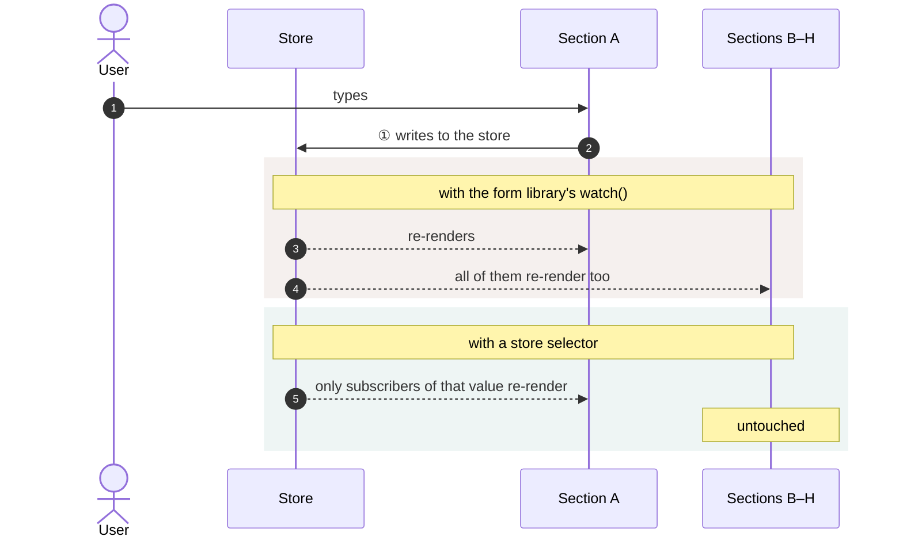
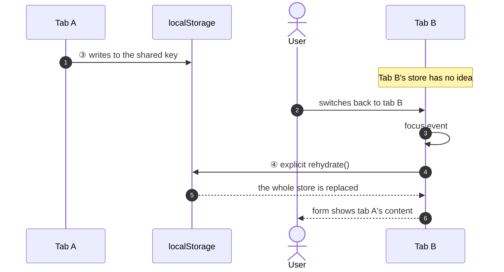

# Seven Scenarios That Force a Three-Way Sync

An equality guard can be derived from a library's docs. Which problems are worth that complexity cannot — so this starts with seven requirements from an admin console of twenty long forms, and only then shows the machinery they add up to.

Five of the seven turn out not to need persistence at all.



Six edges. Two of them are usually left out of diagrams like this, and both matter more than they look:

- **⓪** — the store has a second writer. Dialogs and service functions live outside the form tree and can't reach the form instance, so they write the store directly. This is what makes the store the source of truth rather than a cache.
- **⑤** — the store reaches the screen without passing through the form library at all. Busier than persistence, as the table at the end shows.

---

## Scenario 1 — The draft that survives a closed tab

**What the user does.** Starts filling in a long form, gets pulled into a meeting, the tab is closed. Comes back the next day and opens the create page again.

**What must happen.** "You have an unfinished draft, last edited yesterday at 14:32. Continue?" Pressing continue restores every field.

**Edges used: ① ③ ②**



**The trap.** Most store libraries' `subscribe` is change-only. The store was already correct *before* React rendered, so no change will ever occur, so the subscription never fires. Without an explicit one-line pull at mount, the form sits on empty defaults with a perfectly good draft one function call away.

```ts
syncToForm(store.getState().fields)          // fire-on-subscribe, by hand
const unsubscribe = store.subscribe(s => syncToForm(s.fields))
```

That line looks redundant in review. It isn't.

---

## Scenario 2 — A picker dialog that writes into the form

**What the user does.** Presses "choose an item", a dialog opens over the page, picks one, confirms.

**What must happen.** The form field receives the item's id. The page displays the item's *name* — not the id.

**Edges used: ⓪ ② ⑤ ①**



**Two requirements hide here.**

The dialog is rendered through a portal at the app root. It has no access to the form instance living several levels down, so it can only write to the store — the store is the only address both of them share.

And the display name cannot be looked up later. The item may be delisted or expired by the time the draft is reopened; the option list won't contain it any more. So the *shape the user selected, as it looked at selection time* is stored alongside the fields:

```ts
state: { selectedItemSnapshot: { id, name, thumbnail, status } }
```

This is not a form field — it is never submitted — so the form library has nowhere to put it. It exists only because the store has a second half.

---

## Scenario 3 — Changing a parent clears its child

**What the user does.** Has already chosen a parent option and one of its children. Switches to a different parent.

**What must happen.** The child selection empties. Not just its id — its display name too, or the screen shows a stale label next to a new parent.

**Edges used: ⓪ ② ⑤**

Four values change together: two ids in `fields`, two snapshots in `state`.

```ts
store.setState(prev => ({
  ...prev,
  fields: { ...prev.fields, parentId: next.id, childId: null },
  state:  { ...prev.state, parentSnapshot: next, childSnapshot: null },
}))
```

**Why not four separate writes.** Writing them one at a time produces intermediate states the user can see — the old child's name beside the new parent's id. One `setState` lands all four in the same tick. A form library's `setValue` can only reach two of the four.

---

## Scenario 4 — Eight sections, one of them typing

**What the user does.** Types in the first of eight collapsible sections on a long form.

**What must happen.** The other seven don't re-render.

**Edges used: ⑤**



A form library's `watch()` re-renders the whole subscribed subtree on any field change. A store selector fires only when *that* value changes. In the codebase this pattern came from, `watch` appears zero times — every read goes through a named selector instead.

---

## Scenario 5 — A lock decided by the server's original answer

**What the user does.** Opens a record that is currently live and toggles it to disabled — without saving yet.

**What must happen.** Certain fields stay locked. The lock is decided by **what the server said when the page opened**, not by the toggle the user just moved.

**Edges used: ⓪ ⑤**

```ts
export const useIsInitiallyActive = () =>
  useFormStoreSelector(s => s.state.initialStatus === STATUS.ACTIVE)
```

`initialStatus` is written once on load and never changes. It never appears on screen as a field, is never submitted, and never touches the form library — yet the whole page's locking logic depends on it. It is the clearest example of the category the `state` half exists for: **data that travels with the form without being part of it.**

---

## Scenario 6 — The same record open in two tabs

**What the user does.** Edits in tab A, switches to tab B, switches back.

**What must happen.** Tab A shows the current content.

**Edges used: ③ ④ ②**



**Why this needs its own code.** Persistence middleware typically hydrates once at store creation and never listens for the browser's cross-document `storage` event. Without an explicit focus listener calling `rehydrate()`, tab B is stale forever.

**And this is the dangerous one.** If the storage key is a single constant while the route is `/record/:id/edit`, this exact path is how one record's content lands in another record's form. See the field notes at the end.

---

## Scenario 7 — The unsaved-changes warning that misses half the edits

**What the user does.** Changes something, then presses the browser's back button.

**What must happen.** "You have unsaved changes. Leave anyway?"

**Edges used: ② — as a side effect, not a feature**

```mermaid
sequenceDiagram
    autonumber
    actor U as User
    participant F as Form
    participant S as Store
    participant W as Leave warning

    rect rgb(238,245,244)
    Note over U,W: typed directly
    U->>F: types in an input
    F->>W: isDirty flips true
    W-->>U: warns
    end

    rect rgb(245,240,238)
    Note over U,W: chosen in a dialog
    U->>S: dialog writes to the store
    S->>F: ② reset(fields, keepDirty)
    Note over F: keepDirty preserves an existing true;<br/>it never turns false into true
    F->>W: isDirty still false
    W-->>U: no warning
    end
```

Edge ② uses `reset` as a *transport*, so it must pass `keepDirty` or every store push would clear the dirty flag. But `keepDirty` only preserves — it never sets. Edits that arrive through the store therefore never flip `isDirty`, and the warning silently misses them.

The compensation is a second signal derived from the store: `isDirty || hasDraft`. In edit mode `hasDraft` is true from the moment the page loads, so the warning over-fires. That was accepted as the safer failure.

**This scenario is not a capability. It is a bill.**

---

## What the seven scenarios prove

| Scenario | ⓪ | ① | ② | ③ | ④ | ⑤ |
|---|---|---|---|---|---|---|
| 1 · Draft survives a closed tab | | ● | ● | ● | | |
| 2 · Picker dialog writes in | ● | ● | ● | | | ● |
| 3 · Parent clears its child | ● | | ● | | | ● |
| 4 · Eight sections, one typing | | ● | | | | ● |
| 5 · Lock from the original status | ● | | | | | ● |
| 6 · Two tabs | | | ● | ● | ● | |
| 7 · Unsaved warning | ● | ● | ● | | | |

Two conclusions the mechanism alone cannot give you:

**Only scenarios 1 and 6 need the third party.** The other five are satisfied by two parties — form and store. Persistence is expensive, and four fifths of the requirements don't ask for it.

**Edge ⑤ appears in four scenarios — more than persistence does, and edges ⓪ and ⑤ together cover every scenario the form library cannot serve alone.** The store's job here is less "keep a copy of the form" than "hold what the form has no room for": snapshots that outlive their option list, the server's original answer, per-value subscriptions. Draw this with four edges and the store looks like a redundant mirror. Draw all six and you see what it is for.

---

## The mechanism, briefly

Now that the requirements are on the table, the machinery is short.

Edges ① and ② are subscriptions in opposite directions, each opening with the same guard:

```ts
// ① form → store
form.subscribe({ values: true }, values => {
  if (deepEqual(values, store.getState().fields)) return
  store.setState(prev => ({ ...prev, fields: values }))
})

// ② store → form
store.subscribe(state => {
  if (deepEqual(form.getValues(), state.fields)) return
  form.reset(state.fields, { keepDirty: true })
})
```

The guard is **value equality**, not provenance. Neither side remembers "this update was mine"; each simply refuses to act when there is nothing to do. That terminates the cycle after exactly one bounce, in both directions.

Edge ③ is free — the persistence middleware writes after every store mutation. Edge ④ is the focus listener from scenario 6. Edge ⑤ is ordinary selector subscription and needs no synchronization at all, which is precisely why it is the cheapest way to satisfy scenarios 3, 4 and 5.

---

## Field notes: what it cost

Twenty forms used this bridge. They split cleanly:

| Group | Persistence | Draft metadata | Count |
|---|---|---|---|
| A — ordinary settings forms | `sessionStorage` | none | 12 |
| B — resumable draft forms | `localStorage` | yes | 8 |

Group A is per-tab by definition, so scenario 6 cannot bite them. Group B shares one `localStorage` key across every record behind `/record/:id/edit`, and needed an opt-in flag that suppressed persistence in edit mode.

**Five of the eight passed the flag. Three did not.**

The three were not different in any relevant way — same route shape, same key, same store factory. Nothing failed: it compiled, because the option is optional; it passed review, because a missing argument is invisible; it worked in every single-tab test, because the bug needs two tabs on two different records.

> **A correctness property that depends on every call site opting in will be violated in proportion to the number of call sites.**

Five out of eight is not a discipline problem — it is what an opt-in guard produces at scale. The mechanism made a global resource shared by default, then asked each local call site to opt out. Make the suppression structural instead — persistence only in create mode, decided by the factory rather than the page — and the flag, its ordering contract, and all three bugs stop existing at once.

---

## In one line

Count the scenarios before choosing the architecture — and never make correctness depend on every call site remembering a flag.
