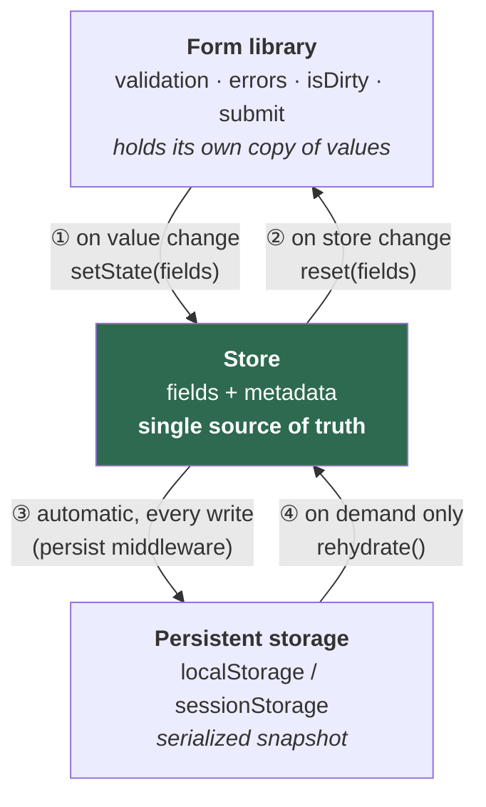
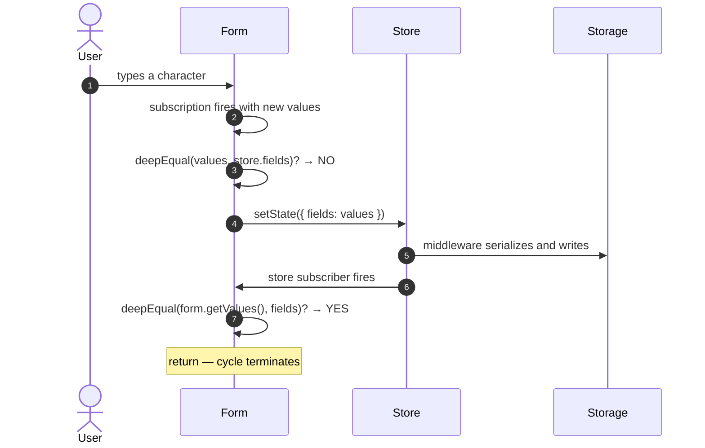
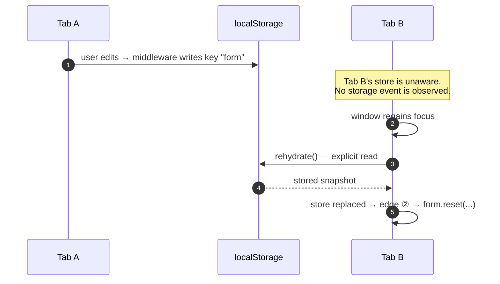
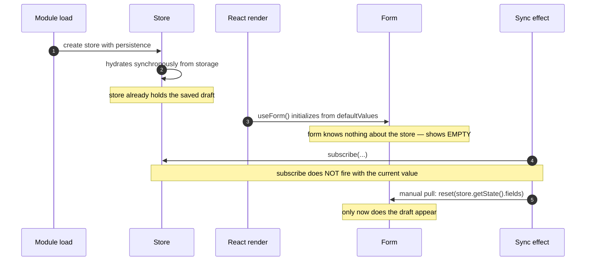
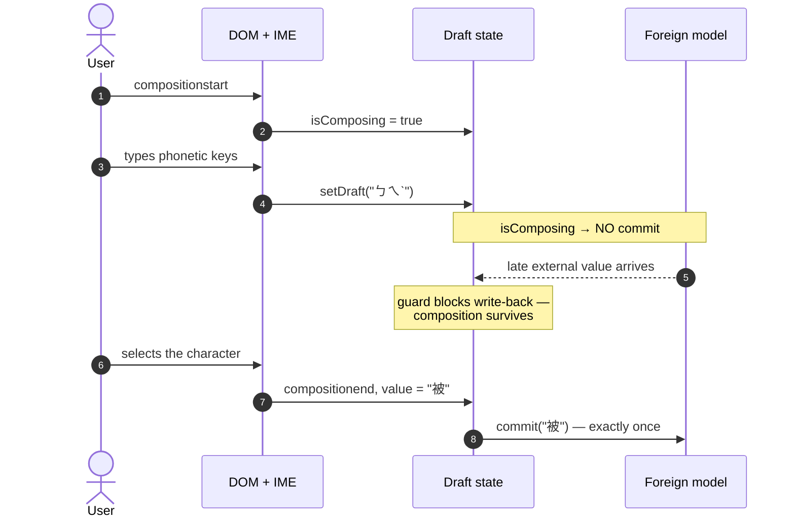
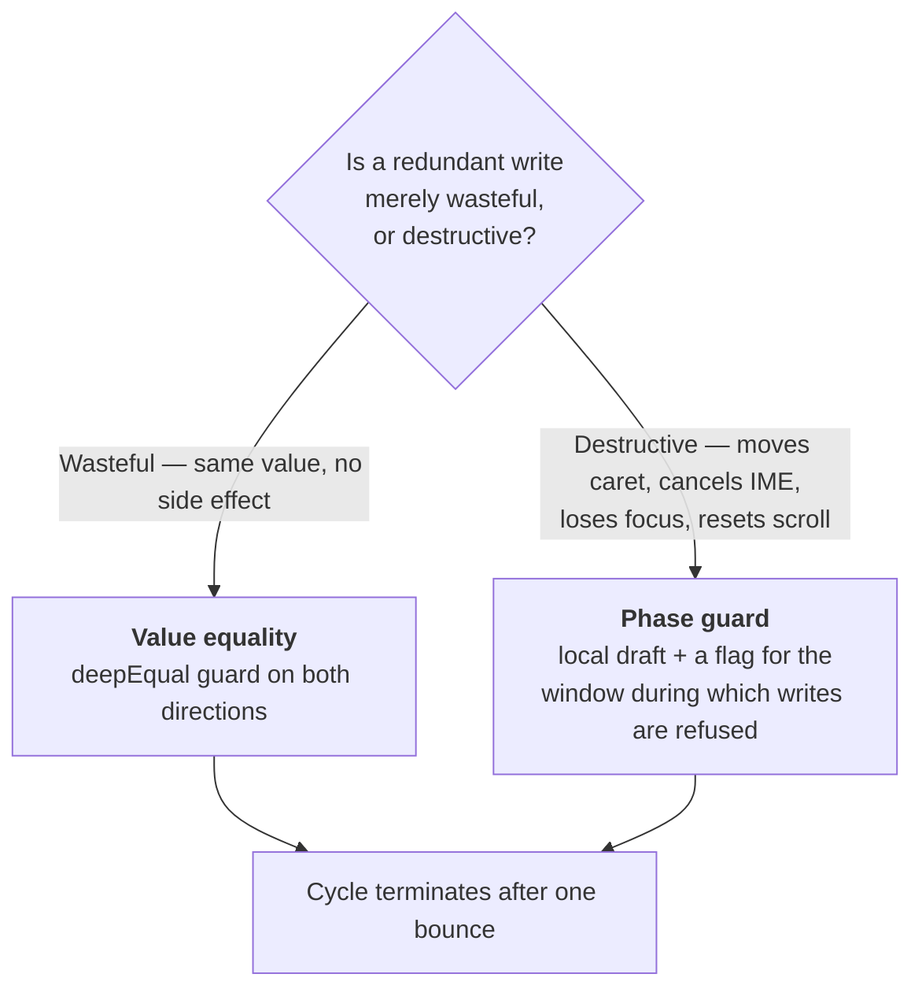

# Multi-Party State Synchronization

**When three things hold the same data, who wins — and how do you stop them from shouting at each other forever?**

Two-way binding is a solved problem. Every UI framework ships one. But real applications routinely end up with *three* parties holding a copy of the same data, each for a reason that cannot be given up. At that point the cycle-breaking that a framework does for you silently stops applying, and you have to design it yourself.

This is a tutorial about that design. It works through two cases, extracts the requirements that forced the complexity in each, presents the mechanism that satisfies them, and ends with what happened when that mechanism met twenty call sites.

> No proprietary code here. Both cases are generalized reference implementations of patterns that appear in real admin applications. Library names (React Hook Form, Zustand, GrapesJS) are public and named because the mechanics depend on their specific behavior.

---

## Table of contents

- [Part 0 — Why three is different from two](#part-0--why-three-is-different-from-two)
- [Part 1 — Case A: Form ↔ Store ↔ Persistent storage](#part-1--case-a-form--store--persistent-storage)
- [Part 2 — Case B: DOM/IME ↔ React ↔ Foreign model](#part-2--case-b-domime--react--foreign-model)
- [Part 3 — The general pattern](#part-3--the-general-pattern)
- [Part 4 — Field notes: where it broke](#part-4--field-notes-where-it-broke)

---

## Part 0 — Why three is different from two

Two parties in a cycle is not a new problem — it is exactly what two-way binding is. What makes it tractable is that **one framework owns both ends**. It knows which write it caused, so it can skip the echo on your behalf.

Add a third party and two things change:

1. **Nobody owns the whole graph.** The form library does not know the store exists; the store does not know about storage; storage does not know about anything. No single component is in a position to break the cycle, so you have to break it yourself, on every edge.
2. **The parties disagree on time.** One is synchronous (the DOM), one is batched (React), one is deferred or out-of-process (an event bus, another browser tab). "The latest value" stops being well-defined.

Everything below answers those two questions: **which party is authoritative**, and **what breaks each cycle**.

---

## Part 1 — Case A: Form ↔ Store ↔ Persistent storage

### The scenario

Picture the settings area of a business admin console — a campaign editor with eight collapsible sections and an embedded rich content editor, a pricing rule builder with dynamically added rows, a notification template with a live preview.

These forms have four properties that a contact form does not:

- **They take fifteen minutes to fill in.** An accidental refresh, a crashed tab, or a mis-clicked back button costs real work.
- **Values are edited from outside the form tree.** A "pick a product" modal, rendered through a portal at the app root, needs to write into a field. A confirmation dialog needs to read three fields to decide its wording. A service function, with no React context available, needs to set a field after a network call resolves.
- **Some state travels with the draft but is not a form field.** "Which segment did the user pick, by name, at the time they picked it" — kept so the label still renders correctly after the underlying option list changes. Or a timestamp recording when the user last edited, used to distinguish a real draft from freshly-loaded defaults.
- **They still need everything a form library gives you.** Schema validation, per-field errors, `isDirty` for the unsaved-changes warning, submit orchestration.

### Extracting the requirements

Read that scenario as a requirements list, and notice that no single tool covers it:

| # | Requirement | Who can satisfy it |
|---|---|---|
| R1 | Schema validation, field-level errors, dirty tracking, submit lifecycle | Form library |
| R2 | Read/write individual values from anywhere in the app, without prop drilling or context plumbing | Global store |
| R3 | Fine-grained subscription — a component reading one field must not re-render when a different field changes | Global store with selectors |
| R4 | Survive a page reload or an accidental tab close | Persistent storage |
| R5 | Carry non-field metadata alongside the draft | Store (form libraries have no slot for it) |
| R6 | Offer to resume a draft only when there really is one — so "has the user actually typed anything?" must be answerable | Metadata + store |

R1 forces a form library. R2, R3, R5, R6 force a store. R4 forces persistent storage. **Three parties, none removable.** That is the bar: if you can strike one requirement, strike it and stay at two.

### The topology



Note the asymmetry. Edges ① and ② are code you write. Edge ③ is free — the persistence middleware writes after every store mutation without being asked. Edge ④ is the interesting one: it fires **only when someone explicitly calls it**, which turns out to matter a lot.

### Breaking the cycle between form and store

Both directions are implemented as subscriptions, and both begin with the same guard:

```ts
// ① form → store
form.subscribe({ values: true }, (values) => {
  if (deepEqual(values, store.getState().fields)) return   // <- loop breaker
  store.setState((prev) => ({ ...prev, fields: values }))
})

// ② store → form
store.subscribe((state) => {
  if (deepEqual(form.getValues(), state.fields)) return     // <- loop breaker
  form.reset(state.fields, { keepDirty: true })
})
```

The guard is **value equality**, not provenance. Neither side tries to remember "this update came from me". It simply refuses to act when there is nothing to do, and that is enough to terminate the cycle after exactly one bounce:



The reverse direction is symmetric. A service writes to the store directly; edge ② resets the form; the form's own subscription fires; the guard sees equality; it stops.

**Why `keepDirty: true` matters.** A form library's `reset` normally means "this is the new pristine state" and clears the dirty flag. Here `reset` is being used as a *transport*, not a reset. Dropping `keepDirty` would silently disarm the unsaved-changes warning every time the store pushed a value.

**A knock-on cost worth naming.** Because `reset({ keepDirty: true })` does not mark fields dirty, `isDirty` will not flip for edits that arrive *through* the store rather than through the DOM — a rich-text editor writing content into a store field, for example. Real systems compensate with a separate "has a draft" signal derived from the metadata, and warn on `isDirty || hasDraft`.

### Where persistent storage fits

Nothing in the two effects above mentions storage. Edge ③ is entirely the middleware's job: serialize the store after every mutation, write it under a key. Get the store right and persistence follows for free.

Reading back is the asymmetric part. Persistence middleware typically hydrates **once**, at store creation, and never again. It does not listen for the browser's cross-document `storage` event. So a second tab editing the same key is invisible:



Hence an effect that listens for `focus` and `visibilitychange` and calls `rehydrate()` by hand. This is the only path by which storage pushes data back upstream.

Note what that implies: rehydrate-on-focus can overwrite what the user half-typed in *this* tab with what they typed in *another*. Last-writer-wins, triggered by focus — a policy, not a default. See rule 6.

### The mount-time trap

The subtlest bug in this whole pattern lives in the first few milliseconds:



Most store libraries' `subscribe` is **change-only**; it does not fire on subscription. The store was already correct before React rendered, so no change will ever occur, so the subscription will never fire, so the form sits on empty defaults with a perfectly good draft one function call away.

The fix is one line — pull once, manually, immediately before subscribing:

```ts
useEffect(() => {
  syncToForm(store.getState().fields)          // fire-on-subscribe, by hand
  return store.subscribe((s) => syncToForm(s.fields))
}, [form])
```

It is one line and it is invisible in review. It deserves a comment stating *why*, because a future reader will read it as redundant and delete it.

### Initialization is one-shot

Separate from the bridge, something has to decide what the store should contain on entry: a record fetched from the server, application defaults, or the previously persisted draft.

The rule that matters: **apply the first resolved value and then stop listening.** Data-fetching libraries revalidate on window focus and hand you a fresh object; re-applying it would replace the whole store and destroy edits made since the page loaded.

```ts
const applied = useRef(false)

useEffect(() => {
  if (record) {
    if (applied.current) return          // ignore revalidation
    applied.current = true
    store.setState(record, /* replace */ true)
    return
  }
  if (expectsRecord) return              // still loading — do not misread as "create"
  if (isPersistedStale(store.getState())) {
    store.setState(defaults, true)
  }
  // otherwise: keep the persisted draft. The mount-time pull will surface it.
}, [record, expectsRecord])
```

Note what this function does *not* do: it never touches the form. It writes to the source of truth and lets the bridge propagate. Any initializer that also resets the form is doing the bridge's job twice, and the two will eventually disagree.

---

## Part 2 — Case B: DOM/IME ↔ React ↔ Foreign model

### The scenario

You embed a third-party editor — a page builder, a diagram canvas, a WYSIWYG surface. It owns a document model that is not React state. It exposes a property panel that *you* render in React, so your inputs must read and write its model.

Three parties again, but different ones: the **DOM input** (with the operating system's input-method editor layered on top of it), **React**, and the **foreign model**.

### Extracting the requirements

| # | Requirement | Consequence |
|---|---|---|
| R1 | The model is authoritative — undo, programmatic edits, and normalization all originate there | Values must flow model → input |
| R2 | The model notifies asynchronously (event bus, often debounced) | The value React receives is *behind* the keystroke |
| R3 | Typing must not move the caret | A stale value must never be written back into a focused input |
| R4 | Composition-based input (Chinese, Japanese, Korean; also accents and autocomplete on mobile) must not be interrupted | Nothing may write to the input mid-composition |
| R5 | The model must not receive half-formed intermediate text | Commits must be suppressed during composition |

R2 is the whole problem. Even a zero-delay debounce defers the notification by one macrotask, so a naively controlled input renders the *previous* value back into the DOM on every keystroke. The caret jumps to the end mid-word, and any in-flight composition is destroyed, because the browser aborts composition when the underlying value changes beneath it.

```mermaid
sequenceDiagram
    autonumber
    actor U as User
    participant D as DOM input
    participant R as React
    participant M as Foreign model

    U->>D: types "d" into "abc" → "abdc"
    D->>R: change event
    R->>M: model.set("abdc")
    M-->>M: emits change → debounced
    Note over R,M: the next render still carries the old value
    R->>D: value="abc" written back into the DOM
    Note over D,U: caret jumps to the end; composition aborted
    M->>R: (one macrotask later) "abdc" finally arrives
```

### The design: a local draft with phase guards

The fix is *not* value equality — equality cannot help, because the two values genuinely differ during the lag window and you still must not write. The fix is to **give the DOM its own never-lagging copy** and gate the write-back on a phase flag.

```ts
function useControlledDraft(externalValue: string, onCommit?: (v: string) => void) {
  const [draft, setDraft] = useState(externalValue)
  const isComposing = useRef(false)

  // write-back is gated on composition phase, not on value equality
  useEffect(() => {
    if (!isComposing.current) setDraft(externalValue)
  }, [externalValue])

  return {
    value: draft,                                   // DOM binds to the draft — never lags
    onChange: (e) => {
      setDraft(e.target.value)                      // 1. DOM truth, synchronously
      if (e.nativeEvent.isComposing) return         // 2. never commit mid-composition
      onCommit?.(e.target.value)                    // 3. commit to the model
    },
    onCompositionStart: () => { isComposing.current = true },
    onCompositionEnd: (e) => {
      isComposing.current = false
      setDraft(e.currentTarget.value)
      onCommit?.(e.currentTarget.value)             // one commit, final value only
    },
  }
}
```



Two details that are easy to get wrong:

- **`useRef`, not `useState`, for the composition flag.** It is read inside an effect and a handler within the same tick, and must not schedule a render of its own.
- **Check `isComposing` on the event, *and* keep the ref.** They answer different questions. The event flag decides *whether to commit this keystroke*; the ref decides *whether to accept an inbound write* at an arbitrary later moment. Some browsers fire the final composition `input` event with `isComposing` still true, which is exactly why the commit is deferred to `compositionend`.

### Why the two cases need different loop breakers

| | Case A | Case B |
|---|---|---|
| Third party | Serialized storage | Foreign document model |
| Lag | Cross-tab, unbounded | One macrotask, bounded |
| Danger of a stale write | Stale data | Stale data **plus a destroyed caret / composition** |
| Loop breaker | **Value equality** — refuse to act when equal | **Phase guard** — refuse to act while a phase is active |
| Local copy | None; the store is read directly | Yes; a draft the DOM binds to |

The lesson generalizes: **value equality only works when a wrong write is merely redundant.** The moment a wrong write is *destructive* — it moves a caret, cancels an IME session, scrolls a list, closes a menu — equality is the wrong tool, because the values legitimately differ at the moment you must not write. You need to know *what phase you are in*, not *what the value is*.

---

## Part 3 — The general pattern

Distilled from both cases, in the order you should apply them.

### 1. Name the single source of truth, once, explicitly

Every other party is a projection. In Case A it is the store; in Case B it is the foreign model. Write it in a comment at the top of the module. Most three-way bugs are two parties each believing they are authoritative.

### 2. Give every edge a loop breaker, and pick the right kind



Provenance tagging ("ignore updates I caused") is a third option and generally the worst: the tag has to survive every hop, and it fails silently the moment a value is transformed on the way through.

### 3. Handle the fire-on-subscribe gap explicitly

Most subscription APIs are change-only. If a party can already hold correct data *before* you subscribe, pull once by hand immediately before subscribing. Comment it, or someone will delete it as redundant.

### 4. Scope persistence keys to instance identity

If a route edits many records through one component, the storage key must include the record's identity:

```
✅  draft:campaign:1042
❌  draft:campaign          + an opt-out flag at each call site
```

This is the single highest-leverage rule in the whole tutorial, and Part 4 explains why.

### 5. Encode contracts in types, not comments

Three-way bridges accumulate ordering rules — "call this before that", "mount this exactly once". A rule stated only in a doc comment is a rule that will be broken. Prefer composing the two calls into one, so ordering cannot be expressed wrongly:

```ts
// ❌ two calls, order matters, enforced by a comment
useBridge(form, { skipPersist })
useInitialize({ record })

// ✅ one call, order is not the caller's problem
useFormBridge(form, { record, instanceKey: id })
```

### 6. Decide the cross-tab policy deliberately

Last-writer-wins on focus is a *policy*, not a default. Write it down. If two tabs editing the same record is a real scenario rather than an accident, focus-triggered rehydration is not sufficient.

---

## Part 4 — Field notes: where it broke

The mechanism above is sound. This is what happened when it met twenty call sites. The numbers come from an actual audit; only the naming is anonymized.

### The setup

Twenty forms used the same bridge. They split cleanly into two groups:

| Group | Persistence | Draft metadata | Count |
|---|---|---|---|
| A — ordinary settings forms | `sessionStorage` | none | 12 |
| B — resumable draft forms | `localStorage` | yes | 8 |

Group A used `sessionStorage`, which is **per-tab by definition**. Cross-tab contamination is structurally impossible there.

Group B used `localStorage`, shared across every tab of the origin. Each of the eight had a hard-coded storage key and an edit route of the shape `/thing/:id/edit`. All eight therefore shared one key across every record — and needed the opt-out flag that suppressed persistence in edit mode.

### The result

**Five of the eight passed the flag. Three did not.**

The three that did not were not different in any relevant way: same route shape, same `id`-derived mode, same hard-coded key, same store factory. They were simply written at a different time by someone who did not know the flag existed. Nothing failed:

- It compiled — the option is optional.
- It passed review — the missing argument is invisible unless you already know to look.
- It worked in every single-tab test — the bug requires two tabs open on two different records.

The failure only appears when a user opens record #1 in one tab and record #2 in another, edits the first, and switches back to the second. Focus fires, `rehydrate()` reads the shared key, and record #1's content lands in record #2's form.

### What that measurement actually proves

It is easy to read this as "someone forgot". The more useful reading:

> **A correctness property that depends on every call site opting in will be violated in proportion to the number of call sites.**

Five out of eight is not a discipline problem; it is what an opt-in guard produces at scale. The mechanism made a *global* resource (one storage key) shared by default, then asked each *local* call site to opt out of the sharing. That is backwards. Scope the key to the record id — rule 4 above — and the flag, its ordering contract, its documentation, and all three bugs stop existing at once. There is no contamination to suppress when there is nothing shared.

### The honest scorecard

| Design decision | Verdict |
|---|---|
| Three parties at all | **Justified.** Group B genuinely needed non-field draft metadata that a form library has no slot for. |
| Value-equality loop breakers | **Good.** Simple, symmetric, no provenance bookkeeping, terminates in one bounce. |
| Manual fire-on-subscribe pull | **Good, and load-bearing.** Worth its comment. |
| One-shot initialization | **Good.** Correctly identifies revalidation as the hazard. |
| Module-level singleton store | **Costly.** Forces a single-consumer rule, an ordering contract, and the opt-out flag — three separate patches on one root decision. |
| Shared key + opt-out flag | **Failed in practice.** 5/8 compliance, three silent cross-tab bugs. |

Good mechanism; the wrong default. That combination is worth recognizing, because it is invisible from inside the mechanism — every individual piece of that bridge is well-built, well-commented, and correct. What is wrong is a decision made one level up, about what should be shared and what should be scoped, and no amount of care inside the bridge can compensate for it.

---

## In one line

Three parties are worth it only when three requirements are each irreplaceable. Once you are there, name the authoritative one, break every cycle explicitly — value equality when a wrong write is merely redundant, a phase guard when it is destructive — and scope anything shared by instance identity, so that no call site ever has to remember to opt out.
